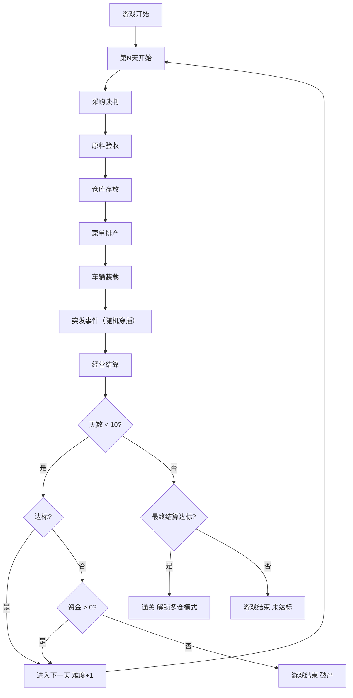

## 1. 产品概述

城市中央厨房供应链调度模拟游戏——玩家扮演调度员，在限定天数内保障学校、医院和企业食堂准时供餐。通过七大关卡体验从采购到结算的完整供应链管理流程，平衡成本、营养、时效与突发事件，解锁多仓配送挑战。

- 核心问题：让玩家在趣味模拟中理解中央厨房供应链调度的复杂性与决策逻辑
- 目标用户：策略/模拟类游戏爱好者、供应链从业者及学习者

## 2. 核心功能

### 2.1 用户角色

| 角色 | 说明 |
|------|------|
| 供应链调度员 | 玩家唯一角色，负责全部七大关卡的决策 |

### 2.2 功能模块

1. **主界面**：游戏开始、天数进度、总览仪表盘、关卡入口
2. **采购谈判关卡**：比较供应商报价、选择供应商
3. **原料验收关卡**：检查保质期与品质、合格/退货判定
4. **仓库存放关卡**：冷藏/常温区位分配、FIFO管理
5. **菜单排产关卡**：搭配每日菜单、平衡成本与营养
6. **车辆装载关卡**：装载优化、车辆分配、路线规划
7. **突发事件关卡**：处理供应商迟到、原料短缺、车辆故障、临时加单、食品召回
8. **经营结算关卡**：满意度、浪费率、准点率、利润结算，解锁下一阶段

### 2.3 页面详情

| 页面名称 | 模块名称 | 功能描述 |
|----------|----------|----------|
| 主界面 | 顶部状态栏 | 显示当前天数、资金、声望等级 |
| 主界面 | 仪表盘面板 | 四项核心指标可视化（满意度/浪费率/准点率/利润） |
| 主界面 | 关卡导航 | 七大关卡入口，按序解锁 |
| 采购谈判 | 供应商报价表 | 多供应商横向比价，显示单价/运费/交期/信誉 |
| 采购谈判 | 下单面板 | 选择供应商和采购数量，确认下单 |
| 原料验收 | 到货清单 | 列出待检原料及供应商信息 |
| 原料验收 | 质检判定 | 保质期、外观、温度检测，合格/退货操作 |
| 仓库存放 | 仓库平面图 | 冷藏区/冷冻区/常温区可视化布局 |
| 仓库存放 | 货位分配 | 拖拽或选择将原料放入对应区位 |
| 菜单排产 | 菜谱库 | 可选菜谱列表，含食材需求、营养分、成本 |
| 菜单排产 | 每日菜单编辑 | 为三类客户（学校/医院/企业）搭配每日菜单 |
| 车辆装载 | 车辆列表 | 可用冷链车/普通车，容量与温控属性 |
| 车辆装载 | 装载编辑器 | 将餐食分配到车辆，优化装载率 |
| 车辆装载 | 路线规划 | 为司机规划配送路线，最短路径计算 |
| 突发事件 | 事件卡片 | 随机弹出突发事件，显示事件详情和倒计时 |
| 突发事件 | 应对选项 | 2-3个应对方案，各有不同代价和结果 |
| 经营结算 | 日报面板 | 本日经营数据汇总 |
| 经营结算 | 指标雷达图 | 四维指标可视化 |
| 经营结算 | 解锁提示 | 达标后解锁下一阶段/多仓模式 |

## 3. 核心流程

玩家每天依次经历七大关卡，完成全部关卡后进入经营结算。根据结算指标决定是否解锁更高难度。游戏共10天，难度递增。

突发事件可在任何关卡间随机触发，玩家需即时应对。

## 4. 用户界面设计

### 4.1 设计风格

- **主色调**：深灰底色 (#1a1a2e) + 琥珀色强调 (#f59e0b) + 翠绿成功 (#10b981) + 红色警告 (#ef4444)
- **按钮风格**：圆角矩形，琥珀色主按钮，灰底次按钮，带hover发光效果
- **字体**：标题用 "Noto Sans SC" 粗体，正文用 "Noto Sans SC" 常规，数据用等宽字体 "JetBrains Mono"
- **布局风格**：卡片式模块布局，左侧固定导航，右侧内容区滚动
- **图标风格**：线性图标 (Lucide)，统一2px描边
- **整体氛围**：工业调度指挥中心风格，暗色仪表盘，数据密集但层次分明

### 4.2 页面设计概览

| 页面名称 | 模块名称 | UI要素 |
|----------|----------|--------|
| 主界面 | 顶部状态栏 | 深色背景，琥珀色数字，等宽字体 |
| 主界面 | 仪表盘面板 | 四个指标卡片，进度环/条形图，微动画 |
| 主界面 | 关卡导航 | 竖向时间轴，节点发光，当前关卡高亮 |
| 采购谈判 | 报价表 | 表格卡片，最低价高亮，信誉星级 |
| 采购谈判 | 下单面板 | 侧边抽屉，数量滑块，实时总价 |
| 原料验收 | 到货清单 | 列表卡片，状态标签（待检/合格/退货） |
| 原料验收 | 质检判定 | 弹出检测面板，合格率进度条 |
| 仓库存放 | 仓库平面图 | 网格布局，区位色块，占用率热力图 |
| 仓库存放 | 货位分配 | 点击货位弹出选择器 |
| 菜单排产 | 菜谱库 | 卡片瀑布流，营养标签，成本标注 |
| 菜单排产 | 每日菜单 | 三列布局（学校/医院/企业），拖拽排序 |
| 车辆装载 | 装载编辑器 | 车辆截面图，餐食拖入分区 |
| 车辆装载 | 路线规划 | 地图式画布，路径连线，里程标注 |
| 突发事件 | 事件卡片 | 全屏遮罩弹出，倒计时闪烁，紧急红色边框 |
| 突发事件 | 应对选项 | 选项卡片，代价标签，选择后结果动画 |
| 经营结算 | 日报面板 | 数据表格，趋势箭头 |
| 经营结算 | 指标雷达图 | Canvas绘制四维雷达图 |
| 经营结算 | 解锁提示 | 全屏庆祝动画，解锁徽章 |

### 4.3 响应式

- 桌面优先设计，最小宽度1024px
- 平板端（768-1024px）导航折叠为底部标签栏
- 不支持移动端（游戏复杂度需要较大屏幕）

### 4.4 3D场景指引

不适用，本游戏为2D界面。
