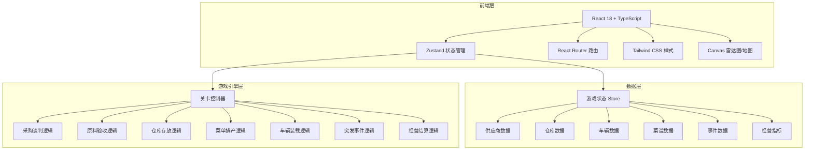
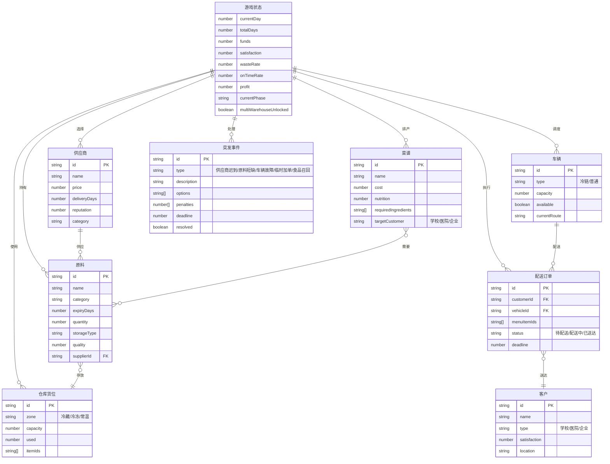

## 1. 架构设计



## 2. 技术说明

- **前端**：React 18 + TailwindCSS 3 + Vite
- **初始化工具**：vite-init
- **后端**：无（纯前端游戏，数据存储在内存/localStorage）
- **数据库**：无（使用 localStorage 持久化存档）
- **状态管理**：Zustand
- **路由**：React Router DOM v6
- **图表**：Canvas API 自绘（雷达图、进度环）
- **动画**：CSS transitions + keyframes

## 3. 路由定义

| 路由 | 用途 |
|------|------|
| `/` | 主界面/仪表盘 |
| `/procurement` | 采购谈判关卡 |
| `/inspection` | 原料验收关卡 |
| `/warehouse` | 仓库存放关卡 |
| `/menu` | 菜单排产关卡 |
| `/loading` | 车辆装载关卡 |
| `/emergency` | 突发事件关卡 |
| `/settlement` | 经营结算关卡 |

## 4. API定义

无后端API，所有数据通过 Zustand store 管理。

## 5. 服务器架构图

不适用（纯前端项目）。

## 6. 数据模型

### 6.1 数据模型定义



### 6.2 数据定义语言

使用 TypeScript 类型定义替代 DDL：

```typescript
interface GameState {
  currentDay: number;
  totalDays: number;
  funds: number;
  satisfaction: number;
  wasteRate: number;
  onTimeRate: number;
  profit: number;
  currentPhase: Phase;
  multiWarehouseUnlocked: boolean;
  suppliers: Supplier[];
  ingredients: Ingredient[];
  warehouseSlots: WarehouseSlot[];
  recipes: Recipe[];
  vehicles: Vehicle[];
  orders: DeliveryOrder[];
  customers: Customer[];
  activeEvents: EmergencyEvent[];
  completedEvents: EmergencyEvent[];
}

type Phase = 'procurement' | 'inspection' | 'warehouse' | 'menu' | 'loading' | 'emergency' | 'settlement';

interface Supplier {
  id: string;
  name: string;
  category: string;
  pricePerUnit: number;
  deliveryDays: number;
  reputation: number;
}

interface Ingredient {
  id: string;
  name: string;
  category: string;
  expiryDays: number;
  receivedDay: number;
  quantity: number;
  storageType: 'cold' | 'frozen' | 'ambient';
  quality: number;
  supplierId: string;
  slotId?: string;
  inspected: boolean;
}

interface WarehouseSlot {
  id: string;
  zone: 'cold' | 'frozen' | 'ambient';
  capacity: number;
  itemIds: string[];
}

interface Recipe {
  id: string;
  name: string;
  cost: number;
  nutritionScore: number;
  requiredIngredients: { ingredientId: string; quantity: number }[];
  targetCustomer: 'school' | 'hospital' | 'enterprise' | 'all';
}

interface Vehicle {
  id: string;
  type: 'cold_chain' | 'normal';
  capacity: number;
  available: boolean;
  currentRoute: string[];
}

interface DeliveryOrder {
  id: string;
  customerId: string;
  vehicleId?: string;
  menuItemIds: string[];
  status: 'pending' | 'delivering' | 'delivered' | 'failed';
  deadline: number;
}

interface Customer {
  id: string;
  name: string;
  type: 'school' | 'hospital' | 'enterprise';
  satisfaction: number;
  location: string;
}

interface EmergencyEvent {
  id: string;
  type: 'supplier_late' | 'ingredient_shortage' | 'vehicle_breakdown' | 'rush_order' | 'food_recall';
  description: string;
  options: EventOption[];
  deadline: number;
  resolved: boolean;
  selectedOption?: number;
}

interface EventOption {
  label: string;
  description: string;
  costPenalty: number;
  satisfactionPenalty: number;
  timePenalty: number;
}
```
